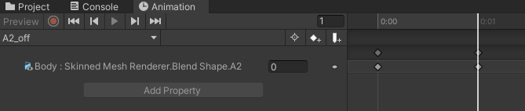

# Avatar Build & Setup Guide

This guide explains, step-by-step, how to connect the MIDI transposer to a VRChat avatar using OSC messages. It covers Blender shape keys, Unity + VRC SDK (FX/Animator), animation naming conventions, blend trees, and local avatar configuration for testing.

Quick summary (contract)

- Inputs: MIDI note names / OSC paths (see `docs/OSC_PARAMETERS.md`).
- Output: Avatar that responds to MIDI notes via parameters (0.0 = off, 1.0 = on) with blend trees handling smooth transitions.
- Error modes: missing shape keys, mismatched parameter names in Unity, or network/firewall blocking OSC messages.

Replace the example images in `docs/assets/` with your own screenshots. Recommended filenames are listed near the end of this document.

## 1) Add shape keys in Blender (use the note names)

1. Open your avatar model in Blender.
2. Select the mesh that contains the deformations you want to control like faces for the key.
3. Switch to the Object Data Properties (green triangle icon) and open the Shape Keys panel.
4. Make sure you have a `Basis` shape key. If not, add it as the first key.
5. For each MIDI note you want to map, create a new shape key and name it exactly after the note name the transposer sends. Example names: `A1`, `C4`, `G#3`.
   - Convention: the single shape key represents the "on" position. Use value 1.0 for "note on" and 0.0 for "note off".
6. Sculpt or edit each shape key so it visually represents the note-on expression you want.
7. Export the model to FBX with shape keys included (FBX exporter: set "Apply Modifiers" if needed and ensure "Shape Keys"/"BlendShapes" are exported).

Note: Keep naming and capitalization exact — Unity and the transposer will rely on exact parameter names.

## 2) Create parameters in Unity (VRC SDK)

1. Open your Unity project that has the VRC SDK installed.
2. Import your exported FBX and place the avatar in the scene to inspect it.
3. Open the VRChat SDK -> open the Avatar Descriptor for your avatar.
4. Go to the `FX` tab in the Avatar Descriptor.
5. Assign (or create) an Animator Controller for the FX layer.
6. Open the Animator Controller and select the FX layer to edit states.
7. Add one parameter per MIDI note:
   - Type: Bool (for simple on/off).
   - Name: exactly the note name you used in Blender (`A1`, `C4`, etc.). You may optionally use a prefix like `note_A1` — be consistent and update mappings accordingly.
8. Pitch Bend: create two Float parameters named `PitchUp` and `PitchDown` for pitch wheel control (0.0 to 1.0).

Example: create a Bool parameter named `A1` (0.0 = off, 1.0 = on).


## 3) Create animations (on and off)

1. Create two Animation Clips for each note:
   - `<Note>` (e.g. `A1`) — sets the shape key to the on position (value 1.0) or plays the activation movement.
   - `<Note>_off` (e.g. `A1_off`) — sets the shape key back to 0.0 (rest).
2. Name the clips exactly as shown: `<Note>` and `<Note>_off`.
3. Store clips under a folder like `Assets/Animations/` and reference them in the Animator Controller.

> Tip: you can duplicate the animation clips in the Project/Explorer window and rename them to save time. This can also be scripted or handled with a bulk rename tool. Don't forget to update the referenced shape key name inside the animation file (you can open the .anim file in a text editor if needed).




## 4) Create blend trees in the Animator for each key

1. In the FX Animator Controller, create a state for each note that uses a Blend Tree.
2. Right-click in the Animator -> Create State -> From New Blend Tree.
3. Open the Blend Tree and set its Type to `1D`.
4. Set the Blend Parameter to the float parameter you created for that note (e.g. `A1`).
5. Add two motions to the blend tree:
   - `<Note>_off` with threshold `0.0`
   - `<Note>` with threshold `1.0`
6. The blend tree will interpolate between off and on based on the parameter value (0..1).
7. Repeat the process for every mapped note.

> Tip: If you have many notes, consider using an automated Editor script to generate parameters and blend trees.


## 5) Publish parameters in the Avatar Descriptor

1. After creating parameters in the Animator, open the Avatar Descriptor -> FX tab again.
2. Under the `Parameters` section add the same parameters (name and type) you used in the Animator. This makes them visible to VRChat at runtime.

## 6) Local Avatar Config (for local testing)

Warning: editing files in the VRChat LocalAvatarData folder can affect local state. Back up files before changing anything.

1. Windows path (example):

```
C:\Users\<YourUserName>\AppData\LocalLow\VRChat\VRChat\LocalAvatarData\
```

2.  Files here are managed by VRChat. If you inspect them, use a plain text editor for JSON-like files only.
3.  Look for a file named like your avatar blueprint id.
4.  Edit your parameters: - Verify that your parameter names are present in any parameter lists you inspect. - Make sure the format is right. Here for example is a snippet of a parameter list:

    ```json
    {
      "eyeHeight": 0,
      "legacyFingers": false,
      "animationParameters": [
        { "name": "A0", "value": 0 },
        { "name": "A1", "value": 0 },
        { "name": "A2", "value": 0 },
        { "name": "A3", "value": 0 },
        { "name": "A4", "value": 0 },
        { "name": "A5", "value": 0 },
        { "name": "A6", "value": 0 },
        { "name": "A7", "value": 0 },
        { "name": "B0", "value": 0 },
        { "name": "B1", "value": 0 },
        { "name": "B2", "value": 0 },
        { "name": "B3", "value": 0 },
        { "name": "B4", "value": 0 },
        { "name": "B5", "value": 0 },
        { "name": "B6", "value": 0 },
        { "name": "B7", "value": 0 },
        { "name": "C1", "value": 0 },
        { "name": "C2", "value": 0 },
        { "name": "C3", "value": 0 },
        { "name": "C4", "value": 0 },
        { "name": "C5", "value": 0 },
        { "name": "C6", "value": 0 },
        { "name": "C7", "value": 0 },
        { "name": "C8", "value": 0 },
        { "name": "D1", "value": 0 },
        { "name": "D2", "value": 0 },
        { "name": "D3", "value": 0 },
        { "name": "D4", "value": 0 },
        { "name": "D5", "value": 0 },
        { "name": "D6", "value": 0 },
        { "name": "D7", "value": 0 },
        { "name": "E1", "value": 0 },
        { "name": "E2", "value": 0 },
        { "name": "E3", "value": 0 },
        { "name": "E4", "value": 0 },
        { "name": "E5", "value": 0 },
        { "name": "E6", "value": 0 },
        { "name": "E7", "value": 0 },
        { "name": "F1", "value": 0 },
        { "name": "F2", "value": 0 },
        { "name": "F3", "value": 0 },
        { "name": "F4", "value": 0 },
        { "name": "F5", "value": 0 },
        { "name": "F6", "value": 0 },
        { "name": "F7", "value": 0 },
        { "name": "G1", "value": 0 },
        { "name": "G2", "value": 0 },
        { "name": "G3", "value": 0 },
        { "name": "G4", "value": 0 },
        { "name": "G5", "value": 0 },
        { "name": "G6", "value": 0 },
        { "name": "G7", "value": 0 },
        { "name": "ASHARP0", "value": 0 },
        { "name": "ASHARP1", "value": 0 },
        { "name": "ASHARP2", "value": 0 },
        { "name": "ASHARP3", "value": 0 },
        { "name": "ASHARP4", "value": 0 },
        { "name": "ASHARP5", "value": 0 },
        { "name": "ASHARP6", "value": 0 },
        { "name": "ASHARP7", "value": 0 },
        { "name": "CSHARP1", "value": 0 },
        { "name": "CSHARP2", "value": 0 },
        { "name": "CSHARP3", "value": 0 },
        { "name": "CSHARP4", "value": 0 },
        { "name": "CSHARP5", "value": 0 },
        { "name": "CSHARP6", "value": 0 },
        { "name": "CSHARP7", "value": 0 },
        { "name": "DSHARP1", "value": 0 },
        { "name": "DSHARP2", "value": 0 },
        { "name": "DSHARP3", "value": 0 },
        { "name": "DSHARP4", "value": 0 },
        { "name": "DSHARP5", "value": 0 },
        { "name": "DSHARP6", "value": 0 },
        { "name": "DSHARP7", "value": 0 },
        { "name": "FSHARP1", "value": 0 },
        { "name": "FSHARP2", "value": 0 },
        { "name": "FSHARP3", "value": 0 },
        { "name": "FSHARP4", "value": 0 },
        { "name": "FSHARP5", "value": 0 },
        { "name": "FSHARP6", "value": 0 },
        { "name": "FSHARP7", "value": 0 },
        { "name": "GSHARP1", "value": 0 },
        { "name": "GSHARP2", "value": 0 },
        { "name": "GSHARP3", "value": 0 },
        { "name": "GSHARP4", "value": 0 },
        { "name": "GSHARP5", "value": 0 },
        { "name": "GSHARP6", "value": 0 },
        { "name": "GSHARP7", "value": 0 },
        { "name": "Headphones", "value": 1 },
        { "name": "Sign", "value": 0 },
        { "name": "Glasses", "value": 1 },
        { "name": "PitchUp", "value": 0.100000001490116 },
        { "name": "PitchDown", "value": 0.100000001490116 },
        { "name": "HUE", "value": 1 }
      ]
    }
    ```

Do not modify binary files. Incorrect edits may break local VRChat behavior.

## 7) Mapping OSC / MIDI -> Avatar and testing

1. Run the `VRC-Midi-Transposer` app with your `config.json`.
2. Make sure `osc.sending_enabled` is `true` in `config.json` or enable OSC sending at runtime from the application's console.
3. The transposer will emit OSC messages for notes — check [`OSC_PARAMETERS.md`](./OSC_PARAMETERS.md) for the full list of parameters it sends.
4. Configure your OSC bridge (VRChat OSC Remote or another bridge) to forward messages to the local VRChat OSC endpoint.
5. Test a note: when a note is played, the associated parameter (e.g. `A1`) should be set to `1.0` and the blend tree will show the `A1` animation. Releasing the note should set the parameter back to `0.0` and return to `A1_off`.

## Edge cases & troubleshooting

- Wrong note names: The mapping depends on exact names. Watch capitalization and whitespace.
- Shape keys not exported: Verify FBX export settings include blendshapes/shape keys.
- Animator complexity: Large numbers of notes can make the Animator hard to manage. Consider automation.
- OSC/network: Firewalls or wrong IP/ports will prevent messages from reaching VRChat.
- Restart VRChat after changing the avatar or parameters to ensure changes take effect.

## Automation / next steps

- Consider a Unity Editor script to auto-generate parameters, animation clips, and blend trees from a list of note names. This saves time 😅👍
